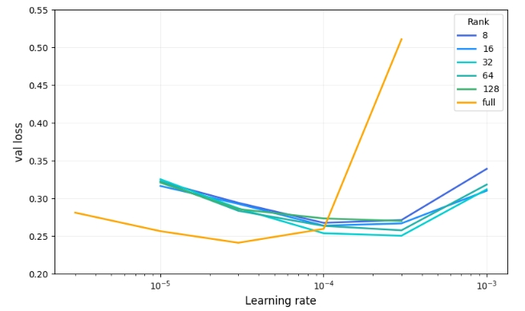

# Lora-Low-Regret
Reproducing Lora Low Regret blog from scratch (no HF) and investigating the LR 10x ratio.


## Preliminary Investigation: Understanding the 10× Learning Rate Ratio

I conducted preliminary experiments to investigate the origin of the `10×` learning rate ratio observed in LoRA training.

### Background

It is important to note that the consistent ratio stems from the `1/r` scaling factor, which implicitly scales the learning rate by the layer width determined by rank `r`, ensuring updates remain invariant to width scaling as discovered by Yang et al. in their [μP approach](https://blog.eleuther.ai/mutransfer/).

### Key Findings

The data shows that performance, as measured by validation loss, is influenced by the `alpha/r` factor, which in turn affects the optimal learning rate ratio.

**General Pattern:**
- When `alpha/r ≤ 1`, the `10×` ratio emerges
- When `alpha/r > 1`, a `3.33×` ratio appears instead
  
  <br>
  
<p align="center">
  
</p>

### Exceptions and Edge Cases

This pattern does not hold universally:

**Rank 32:**
- The `10×` ratio only appears when `alpha/r = 1`, though results are noisy due to training for only `5` epochs under computational constraints
- When trained for `10` epochs with rank `32` and alpha `= 16`, the `10×` ratio emerges consistently

**Rank 64:**
- With `alpha/r = 1`, the `3.33×` ratio holds regardless of training duration (`5` or `10` epochs)
- Smaller and larger `alpha/r` values yield the expected `10×` and `3.33×` ratios, respectively

**Rank 128:**
- The ratio remains `10×` regardless of the `alpha/r` value
- When weight norms are heavily restricted by setting alpha `= 8`, the ratio increases dramatically to `33.3×`

### Caveats

The specific values of `3.33×` and `33.3×` may be artifacts of this experimental setup, as the learning rate sweep was limited and discrete due to computational constraints.

### Summary of Configurations

**Fixed alpha = 32:**
- All ranks converge to an optimal learning rate `10×` higher than full fine-tuning, except for smaller ranks (`8` and `16`)
  
<p align="center">
  
</p>

**Fixed alpha = 8:**
- All ranks optimize at the `10×` ratio
   
<p align="center">
  
</p>

### Performance Considerations

The `10×` ratio does not necessarily correlate with superior performance—the `3.33×` ratio occasionally outperforms it, with the relationship appearing to depend on rank.

### Conclusion

The optimal learning rate for LoRA appears to depend on three factors: rank, `alpha/r` ratio, and training regime as defined by the data and model.


# LoRA Wihtout Regret Fine-tuning
---
## Setup
```bash
pip install -r requirements.txt
```

## Requirements
```
torch
transformers
datasets
scikit-learn
```
---
## Usage

### Basic run (LoRA with default params)
```bash
python main.py
```

### Full fine-tuning
```bash
python main.py --full-finetune
```

### LoRA vs Full Fine-tuning examples

LoRA (default):
```bash
python main.py --epochs 10 --rank 64 --alpha 128
```

Full Fine-tuning:
```bash
python main.py --full-finetune --epochs 10
```
---
## Parameters

- `--lrs`: Learning rates to sweep (default: 1e-4 5e-4 1e-3)
- `--epochs`: Number of training epochs (default: 5)
- `--rank`: LoRA rank (default: 128)
- `--alpha`: LoRA alpha scaling (default: 256)
- `--batch_size`: Batch size (default: 32)
- `--seed`: Random seed (default: 42)
- `--full-finetune`: Use full fine-tuning instead of LoRA

## Output

Results saved to `results.json`:
```json
{
  "0.0001": {
    "best_val_loss": 0.1989,
    "test_acc": 0.9234,
    "train_losses": [...],
    "val_losses": [...]
  }
}
```
